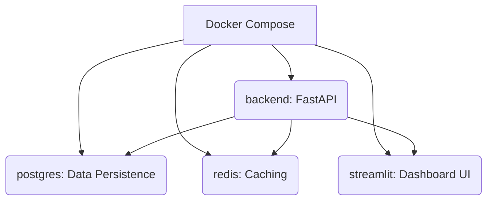

# 📈 Crypto Analytics Dashboard

This project is a crypto analytics dashboard built for the **B2C2 Graduate DeFi Developer exercise**. It provides an end-to-end system that fetches live cryptocurrency prices, stores them in a database, exposes them via a REST API, and offers an interactive web dashboard to explore the data.

-----

## 🚀 Features

### Data Integration

  * Fetches **BTC** and **ETH** prices from [CoinGecko](https://www.coingecko.com).
  * Fetches **cUSD** price via blockchain integration (future extension).
  * Fetches **TVL (Total Value Locked)** for any DeFi protocol using the [DeFi Llama API](https://defillama.com/).
  * Stores data efficiently in **PostgreSQL**.
  * Caching layer with **Redis** for performance and reduced API calls.
  * Graceful error handling for API failures.

### REST API (FastAPI)

The backend exposes the following endpoints:

  * `GET /prices/{symbol}` → Historical prices from the database.
  * `GET /prices/{symbol}/latest` → Most recent saved price.
  * `POST /prices/{symbol}/fetch` → Fetches the latest price from the upstream API and saves it to the database.
  * `GET /tvl/{protocol}` → TVL of a given DeFi protocol (e.g., `aave`).
  * `GET /health` → Healthcheck.

Interactive documentation is available at: **👉 [http://localhost:8000/docs](https://www.google.com/search?q=http://localhost:8000/docs)**

### Web Interface (Streamlit)

The dashboard provides interactive charts for **BTC**, **ETH**, and **cUSD**, featuring:

  * **Data Overlays**: Toggles for Price (blue line), 7-day MA (orange), 30-day MA (green), and $\Delta$ Price proxy bars (grey, as a proxy for volume).
  * **Sidebar Controls**:
      * Select symbol.
      * Manually fetch the latest price.
      * Explore TVL for any DeFi protocol.
      * Toggle **Live Mode** (switches the backend between static and live polling).
  * **Dynamic y-axis scaling** (avoids the flat-line effect when prices vary in a narrow band).

> **Note on Frontend**: The Streamlit interface is **temporary**. I am actively developing a dedicated frontend using **React** and will update the repository with the new application soon.

-----

## 🏗️ Architecture

The entire application is containerized using **Docker Compose** for easy setup and dependency management.



  * **Backend**: FastAPI serving the REST API, handling DB integration, and caching.
  * **Frontend**: Streamlit application served via a separate container for the dashboard UI.
  * **Database**: PostgreSQL for persistent data storage, utilizing a persistent volume.
  * **Cache**: Redis for temporary storage, session management, and throttling external API calls.

-----

## ⚙️ Setup Instructions

### 1\. Clone the Repository

```bash
git clone https://github.com/Aditya19Joshi01/crypto-webapp.git
cd crypto-dashboard
```

### 2\. Run with Docker Compose

Use the following command to build the images and start all services:

```bash
docker compose up --build
```

### 3\. Access Services

| Service | URL / Port | Description |
| :--- | :--- | :--- |
| **API Docs** | **[http://localhost:8000/docs](https://www.google.com/search?q=http://localhost:8000/docs)** | Interactive FastAPI documentation |
| **Dashboard** | **[http://localhost:8501](https://www.google.com/search?q=http://localhost:8501)** | The main Streamlit web interface |
| PostgreSQL | `localhost:5432` | Database connection port |
| Redis | `localhost:6379` | Cache connection port |

### 📦 Requirements

If running locally (without Docker):

```bash
pip install -r requirements.txt
```

### 📊 Sample Output

**API response (`GET /prices/bitcoin/latest`):**

```json
{
  "symbol": "bitcoin",
  "price": 42000.53,
  "timestamp": "2025-10-02T09:30:00Z"
}
```

**TVL response (`GET /tvl/aave`):**

```json
{
  "protocol": "aave",
  "tvl_usd": 5634829183.42,
  "last_updated": "2025-10-02T09:25:00Z"
}
```

-----

## 🔮 Next Steps (Future Enhancements)

  * Real-time updates via **WebSockets**.
  * Web3 wallet integration (MetaMask) to show wallet balances.
  * Authentication & user watchlists.
  * **GraphQL** support as an alternative API.
  * Unit & integration tests.
  * CI/CD pipeline with monitoring.

-----

### 👨‍💻 Author

Developed by **Aditya S Joshi**
As part of the **B2C2 Graduate DeFi Developer application exercise**.